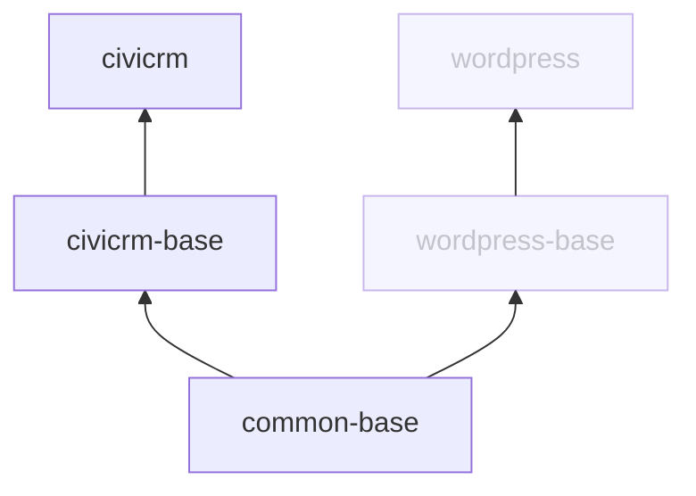

# CiviCRM Docker

This repository contains resources to run CiviCRM on Docker.

Container images are published to [Docker Hub](https://hub.docker.com/u/civicrm) for all stable versions of CiviCRM *standalone* as part of CiviCRM's regular [release process](https://docs.civicrm.org/dev/en/latest/core/release-process/).

If you are looking for a **ready to use** CiviCRM application, use `civicrm/civicrm`. If you are looking for an image that you can use as part of a customised **Docker build process**, use `civicrm/civicrm-base`.

Note: there are currently no official *CiviCRM for WordPress, Joomla Backdrop or Drupal* images.

## Quick start

Run the CiviCRM image with. `docker run -p 8000:80 civicrm/civicrm`. You'll see CiviCRM's installation screen at http://localhost:8000.

For a more complete working example, with sugggested environment variables and volumes, and an accompanying database service, etc., see the annotated docker compose file at `examples/compose.yaml`.

Note: these instructions are not designed for use in a production set up - they are intended to provide a minimal local environment for testing purposes.

1. In the `example` directory, create an `.env` and and define two environment variables:

```shell
# .env
MYSQL_PASSWORD=INSECURE_PASSWORD
MYSQL_ROOT_PASSWORD=INSECURE_PASSWORD
```

2. Start the compose project with:

```shell
docker compose up -d
```

3. Wait for the database to initialise and then install CiviCRM with (note the environment variables that are passed into the container with this command):

```shell
docker compose exec -e CIVICRM_ADMIN_USER=admin -e CIVICRM_ADMIN_PASS=password app docker-civicrm-install
```

4. Visit http://localhost:8760 and log in using the credential supplied above.

## Tags

You can use tags to specify a CiviCRM version and php version, for example: 

`civicrm/civicrm:5.75-php8.3`

### CiviCRM version

Keep up to date with the latest stable '5.x' release by using the tag `5`, which will receive all minor and patch releases.

Pin your site to a minor release by using a minor version tag. For example, `5.75` will receive all patch releases for the 5.75 minor version.

Skip the tag to default to the latest stable release.

### PHP version

Images are published for all supported versions of PHP. Specify a php version with a tag like `php8.3`.

Skip the tag to default to the [the most recent version that CiviCRM recommends](https://docs.civicrm.org/installation/en/latest/general/requirements/#php-version).

### Extended support release

**WORK IN PROGRESS**

Subscribers to the ESR can download images for the ESR from a private registry on https://lab.civicrm.org.

## Building images

If you have specific needs that are not catered for by the pre-built images that are published on Docker Hub, you may want to build an image locally using the Dockerfiles in the `build` directory.

### `build/civicrm`

The `build/civicrm` Dockerfile is suitable for the most straight forward deployments. You must pass one of either `CIVICRM_VERSION` or `CIVICRM_DOWNLOAD_URL` and the `PHP_VERSION` as build arguments:

- `CIVICRM_VERSION` specifies a (stable) CiviCRM version
- `CIVICRM_DOWNLOAD_URL` specifies the tarball to download. Useful to build [release candidates and nightly releases](https://download.civicrm.org/latest/). This argument overrides `CIVICRM_VERSION`.
- `PHP_VERSION` specifies the PHP version. Useful if you want to build using a PHP version that we are not building images for.

For example:

Build an image using CiviCRM 5.75 and PHP version 8.3:

```shell
docker build build/standalone --build-arg CIVICRM_VERSION=5.75 --build-arg PHP_VERSION=8.3 -t my-custom-build
```

Build an image with the latest nightly version of CiviCRM:

```shell
docker build build/standalone --build-arg CIVICRM_DOWNLOAD_URL=https://download.civicrm.org/latest/civicrm-NIGHTLY-standalone.tar.gz --build-arg PHP_VERSION=8.3 -t my-civi/civicrm
```

Build an image with the latest nightly version of CiviCRM and a beta release of PHP. In this case, we'll need to build the intermediary images. The `build.php` can help with this:

```shell
php build.php -v --php-version=8.4.0beta5 --image-prefix=my-civi
```

If you run `docker image ls "my-civi/*"` after this, you will see something like this: 

```
REPOSITORY                        TAG             IMAGE ID       CREATED          SIZE
my-civi/civicrm                   php8.4.0beta5   27977244bbee   1 minutes ago    1.05GB
my-civi/civicrm-standalone        php8.4.0beta5   27977244bbee   1 minutes ago    1.05GB
my-civi/civicrm-base              php8.4.0beta5   c98255ac24d7   7 minutes ago   804MB
my-civi/civicrm-standalone-base   php8.4.0beta5   995fa75acdf5   7 minutes ago   804MB
```

### Custom builds

If you have a custom build process, for example if you have a special way to download CiviCRM, or want to install CiviCRM extensions in the image, consider using `civicrm/civicrm-standalone-base` as your base image.

For example:

```Dockerfile
FROM civicrm/civicrm-standalone-base:php8.3

RUN curl https://whizzy.com/download/whizzy.tar.gz && \
  tar -xf whizzy.tar.gz 
```


### Image architecture



Note: the WordPress images do not currently exist but are here to illustrate how we might add them in the future.

## Management

The `build.php` script can be used to build images.

Calling `build.php` without any arguments will build the latest stable version of CiviCRM and push it to docker hub.

If you are publishing official images on Docker Hub, make sure to run it in an environment that can publish multiplatform images, and can push to the CiviCRM docker account.

Command options are as follows:

- **--image-prefix=** - a custom image prefix (defaults to `civicrm`)
- **--php-version=** - build a specific php version (defaults to all supported versions)
- **--no-cache** - do not use a cache when building the images
- **--skip-push** - build the images but do not push them to Docker Hub
- **--dry-run** - just output the commands that would be executed
- **--step** - run one step at a time
