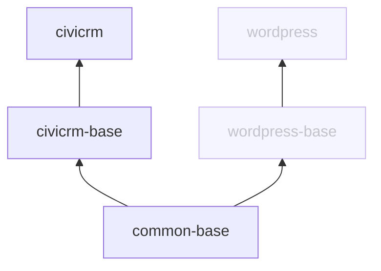

# CiviCRM Docker

This repository contains resources to run CiviCRM on Docker.

Container images are published to [Docker Hub](https://hub.docker.com/u/civicrm) for all stable versions of CiviCRM *standalone* as part of CiviCRM's regular [release process](https://docs.civicrm.org/dev/en/latest/core/release-process/).

If you are looking for a **ready to use** CiviCRM application, use `civicrm/civicrm`. If you are looking for an image that you can use as part of a customised **Docker build process**, use `civicrm/civicrm-base`.

Note: there are currently no official images for CiviCRM with WordPress, Joomla, Backdrop, or Drupal.

## Quick start

Note: these instructions are not designed for use in a production set up - they are intended to provide a minimal local environment for testing purposes. They assume you are comfortable working with docker and docker compose. If that's not the case, then see the resources below for a quick introduction:

- https://docs.docker.com/get-started/
- https://docs.docker.com/compose/gettingstarted

### Running the image

Run the CiviCRM image with. `docker run --detach --publish 8000:80 civicrm/civicrm`. You'll see CiviCRM's installation screen at http://localhost:8000 where you will be prompted for database credentials, etc. 

### With docker compose

A more complete 'quick start' built with docker compose can be found in the [`example`](example) directory.

1. clone this repository `git clone https://github.com/civicrm/civicrm-docker`
2. change into the example directory `cd civicrm-docker/example`
3. create an `.env` file with two environment variables:
```shell
# .env
MYSQL_PASSWORD=INSECURE_PASSWORD        # change these to
MYSQL_ROOT_PASSWORD=INSECURE_PASSWORD   # if you want to
```
4. start the compose project with `docker compose up -d`
5. wait for the database to initialise (you can check progress with `docker compose logs -f`).
6. install CiviCRM with `docker compose exec -u www-data -e CIVICRM_ADMIN_USER=admin -e CIVICRM_ADMIN_PASS=password app civicrm-docker-install` (note that we are passing in the admin username and password as environment variables here - you can change them if you want to).
7. visit http://localhost:8760 and log in using the credential supplied above.
8. when you are finished, bring the project down with `docker compose down`.

## Environment variables

At a minimum, you should set the following environment variables:

- `CIVICRM_DB_HOST`
- `CIVICRM_DB_PORT`
- `CIVICRM_DB_NAME`
- `CIVICRM_DB_USER`
- `CIVICRM_DB_PASSWORD`
- `CIVICRM_UF_BASEURL`

Note that the `CIVICRM_DB_*` can be replaced with a single `CIVICRM_DSN` variable.

**Experimental**: you can override the default apache port (in the container) by setting `APACHE_PORT`.

## Installation


The `civicrm/civicrm` image comes with a convenience script for installing a site: `civicrm-docker-install`. The script expects database credentials and the admin username (`CIVICRM_ADMIN_USER`) and password (`CIVICRM_ADMIN_PASS`) to be set as environment variables.

It calls the standard CiviCRM installation process. See [build/civicrm/civicrm-docker-install](build/civicrm/civicrm-docker-install) for more details and the docker compose instructions above for an example of how you might call this script.

See also https://docs.civicrm.org/installation/en/latest/standalone/ for more details on the CiviCRM Standalone installation.

## Volumes

The `/var/www/html/public`, `/var/www/html/private` and `/var/www/html/ext` directories should be persisted. See the [`example/compose.yaml`](example/compose.yaml) file for an example.

## Tags

You can use tags to specify a CiviCRM version and php version, for example:

`civicrm/civicrm:6.0-php8.3`

### CiviCRM version

Keep up to date with the latest stable '5.x' release by using the tag `5`, which will receive all minor and patch releases. Pin your site to a minor release by using a minor version tag. For example, `6.0` will receive all patch releases for the 6.0 minor version. 
Skip the tag to default to the latest stable release.

### PHP version

Images are published for all supported versions of PHP. Specify a php version with a tag like `php8.3`.

Skip the tag to default to the [the most recent version recommended by CiviCRM](https://docs.civicrm.org/installation/en/latest/general/requirements/#php-version).

### Extended support release

**WORK IN PROGRESS**

Subscribers to the ESR should soon be able to download images for the ESR from a private registry on https://lab.civicrm.org.

## Building images

If you have specific needs that are not catered for by the pre-built images that are published on Docker Hub, you may want to build an image locally using the Dockerfiles in the `build` directory.

### The `build/civicrm` directory

The `build/civicrm` Dockerfile is suitable for the most straight forward deployments. You must pass one of either `CIVICRM_VERSION` or `CIVICRM_DOWNLOAD_URL` and the `PHP_VERSION` as build arguments:

- `CIVICRM_VERSION` specifies a (stable) CiviCRM version
- `CIVICRM_DOWNLOAD_URL` specifies the tarball to download. Useful to build [release candidates and nightly releases](https://download.civicrm.org/latest/). This argument overrides `CIVICRM_VERSION`.
- `PHP_VERSION` specifies the PHP version. Useful if you want to build using a PHP version that we are not building images for.

For example:

Build an image using CiviCRM 6.0 and PHP version 8.3:

```shell
docker build build/civicrm --build-arg CIVICRM_VERSION=6.0 --build-arg PHP_VERSION=8.3 -t my-custom-build
```

Build an image with the latest nightly version of CiviCRM:

```shell
docker build build/civicrm --build-arg CIVICRM_DOWNLOAD_URL=https://download.civicrm.org/latest/civicrm-NIGHTLY-standalone.tar.gz --build-arg PHP_VERSION=8.3 -t my-civi/civicrm
```

Build an image with the latest nightly version of CiviCRM and a specific release of PHP. In this case, we'll need to build the intermediary images.

The `build.php` can help with this:

```shell
./build.php --php-version=8.3 --image-prefix=my-civi --skip-push
```

If you run `docker image ls "my-civi/*"` after this, you will see something like this: 

```
REPOSITORY             TAG            IMAGE ID       CREATED           SIZE
my-civi/civicrm        6              91d9a3048d81   1 minutes ago     694MB
my-civi/civicrm        6-php8.3       91d9a3048d81   1 minutes ago     694MB
my-civi/civicrm        6.0            91d9a3048d81   1 minutes ago     694MB
my-civi/civicrm        6.0-php8.3     91d9a3048d81   1 minutes ago     694MB
my-civi/civicrm        6.0.3          91d9a3048d81   1 minutes ago     694MB
my-civi/civicrm        6.0.3-php8.3   91d9a3048d81   1 minutes ago     694MB
my-civi/civicrm        latest         91d9a3048d81   1 minutes ago     694MB
my-civi/civicrm        php8.3         91d9a3048d81   1 minutes ago     694MB
my-civi/civicrm-base   latest         29f972ae8200   3 minutes ago     561MB
my-civi/civicrm-base   php8.3         29f972ae8200   3 minutes ago     561MB
my-civi/common-base    latest         29f972ae8200   7 minutes ago     561MB
my-civi/common-base    php8.3         29f972ae8200   7 minutes ago     561MB
```

### Custom builds

If you have a custom build process, for example if you have a special way to download CiviCRM, or want to install CiviCRM extensions in the image, consider using `civicrm/civicrm-base` as your base image.

For example:

```Dockerfile
FROM civicrm/civicrm-standalone-base:php8.3

RUN curl https://whizzy.com/download/whizzy.tar.gz && \
  tar -xf whizzy.tar.gz 
```

### Image architecture



Note: the WordPress images do not currently exist but are here to illustrate how we might add them in the future.

## Management

The `./build.php` script can be used to build images.

Calling `./build.php` without any arguments will build the latest stable version of CiviCRM and push it to docker hub.

If you are publishing official images on Docker Hub, make sure to run it in an environment that can publish multiplatform images, and can push to the CiviCRM docker account.

Command options are as follows:

- **--image-prefix=** - a custom prefix for generated images (defaults to `civicrm`)
- **--image-filter=** - only build the specified images (comma seperated list)
- **--php-version=** - build a single specific php version (defaults to all supported versions)
- **--download-url=** - a specific tarball to download  
- **--builder=** - the docker build builder to use
- **--platform=** - the platforms to build for
- **--skip-push** - build the images but do not push them to Docker Hub
- **--no-cache** - do not use a cache when building the images
- **--dry-run** - just output the commands that would be executed
- **--step** - run one step at a time

Note: before running `./build.php`, you will need to install the required dependencies with `composer install` (see https://getcomposer.org/ for more details).
